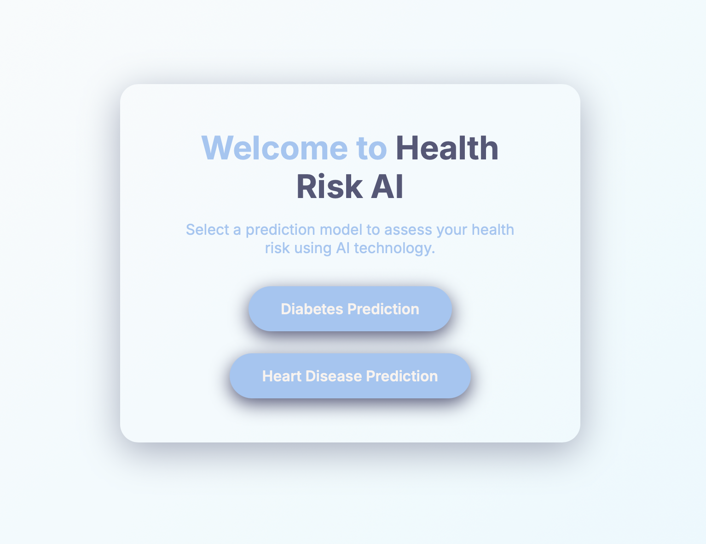
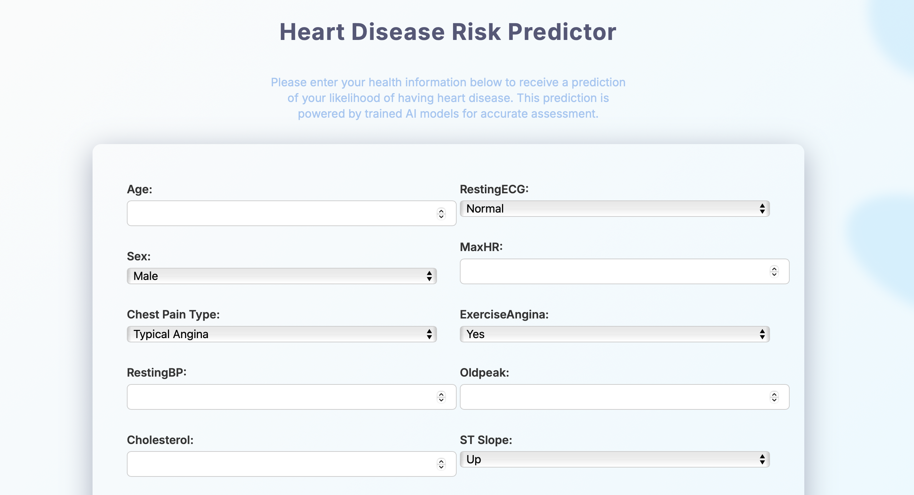

# Health Risk AI

This project is a simple AI-powered web app that predicts the risk of **diabetes** and **heart disease** based on user input. It uses a trained **Random Forest Classifier** model and is built with **Flask** for the backend and **HTML/CSS** for the frontend.

## Features

- Heart disease prediction
- Diabetes prediction
- Clean and user-friendly interface
- Based on real medical datasets

## Tech Stack

- Python
- Flask
- scikit-learn
- HTML/CSS
- Pickle (for saving models)

## Requirements

- Python 3.11+
- pip

## Setup(done in command line)

1. Clone the repository:
   - git clone https://github.com/blxss-shreya/Health-Risk-AI.git
   - cd Health-Risk-AI

2. Create and activate a virtual environment:
   - python3.11 -m venv venv
   - source venv/bin/activate (on macOS/Linux)  
     or venv\Scripts\activate (on Windows)

3. Install dependencies:
   - pip install -r requirements.txt  
     or manually:  
     pip install flask Flask-Cors pandas scikit-learn xgboost

4. Run the app:
   - python main.py

Once running, open http://127.0.0.1:5000 in your browser.

## Notes

- Tested on macOS with Python 3.11 installed via Homebrew.
- If you don’t have Python 3.11, install it using your package manager (e.g., `brew install python@3.11` on macOS).

- 

